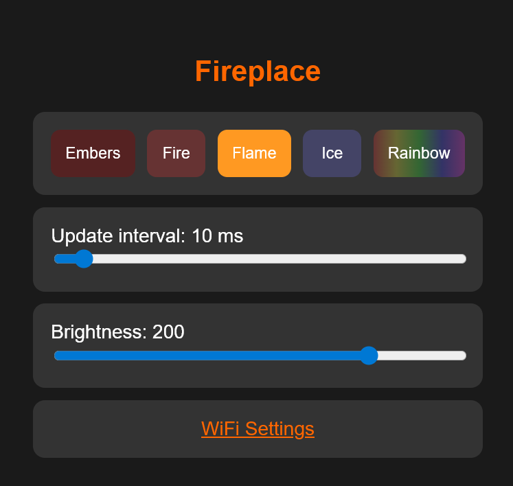
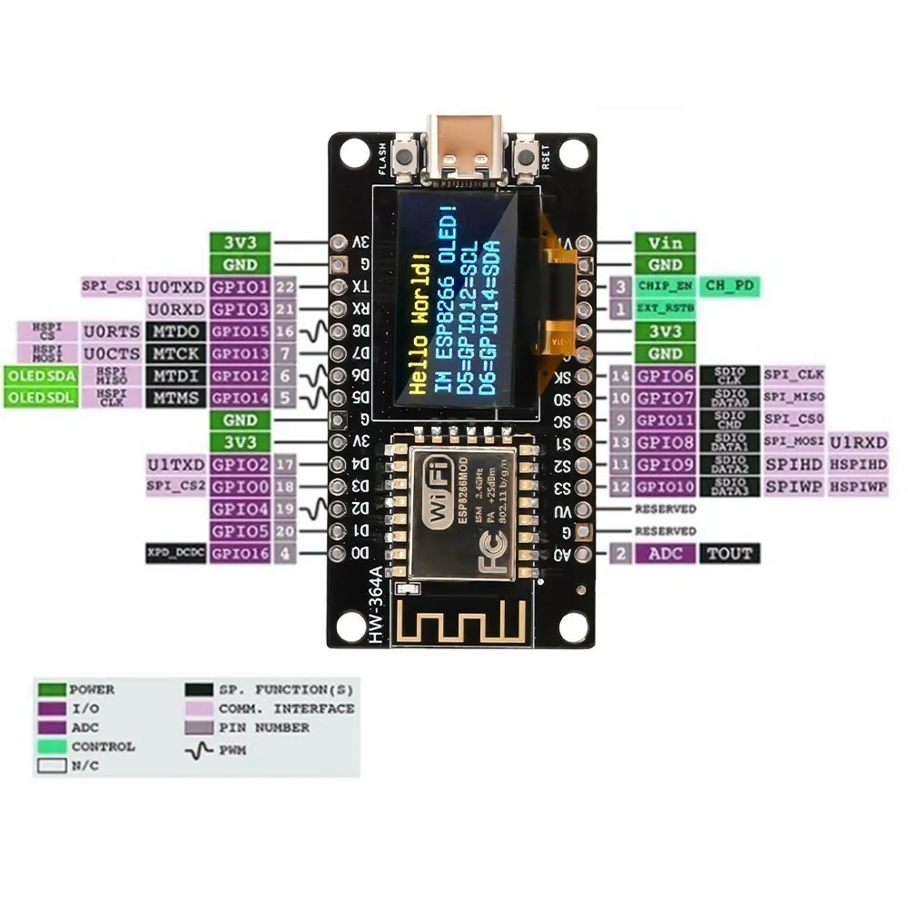
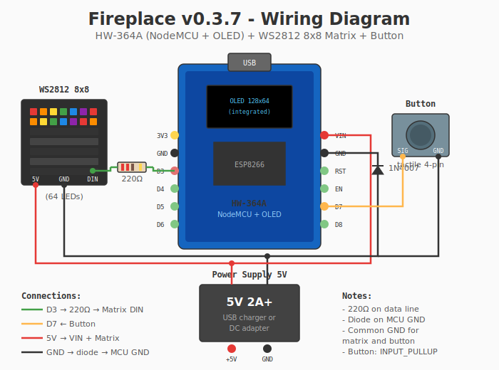

# Fireplace

Эффект пламени камина на светодиодной матрице/ленте WS2811/WS2812 с управлением через веб-интерфейс.



## Железо

Поддерживаются две конфигурации:

### Конфигурация 1: NodeMCU + OLED + Матрица (по умолчанию)



- **Контроллер**: [NodeMCU ESP8266 с OLED (HW-364A)](https://aliexpress.ru/item/1005006211265531.html)
- **Светодиоды**: WS2812 матрица 8x8 (64 LED)
- **Кнопка**: Тактовая кнопка 4-pin
- **Питание**: БП 5V 2A+

### Конфигурация 2: D1 Mini + Лента

- **Контроллер**: Wemos D1 Mini
- **Светодиоды**: WS2811 лента, 144 LED
- **Питание**: БП 5V 3A+

### Схема подключения (Конфигурация 1)



| Компонент | Пин контроллера | Примечание |
|-----------|-----------------|------------|
| Matrix DIN | D3 (GPIO0) | Через резистор 220Ω |
| Button | D7 (GPIO13) | INPUT_PULLUP |
| 5V (БП) | VIN | Через диод 1N4007 на GND |
| GND (БП) | GND | Общая земля |

## Первый запуск

1. Прошейте ESP8266
2. Подключитесь к WiFi сети `Fireplace-Setup` (пароль: `12345678`)
3. Откроется портал настройки WiFi (или перейдите на `192.168.4.1`)
4. Выберите вашу WiFi сеть и введите пароль
5. ESP перезагрузится и подключится к вашей сети

## Веб-интерфейс

После подключения к WiFi откройте в браузере IP-адрес устройства (см. Serial Monitor или проверьте в роутере).

### Режимы

| Режим | Описание |
|-------|----------|
| **Off** | Выключено — все LED погашены |
| **Embers** | Тлеющие угли — медленное, тусклое свечение |
| **Fire** | Средний огонь — сбалансированный режим |
| **Flame** | Яркое пламя — быстрое, яркое мерцание |
| **Ice** | Ледяное пламя — от тёмно-синего до лазурно-голубого |
| **Rainbow** | Радуга — плавное переливание всеми цветами |
| **Firework** | Фейерверк — разноцветные расходящиеся кольца |
| **Storm** | Гроза — молнии на тёмно-синем фоне |
| **Rain** | Дождь — падающие капли с брызгами |
| **Tree** | Дерево — коричневый ствол и колышущаяся зелёная крона |

### Настройки

- **Update interval** (5-100 мс) — интервал обновления, меньше = быстрее мерцание/движение
- **Brightness** (10-255) — общая яркость ленты

При выборе режима автоматически применяются пресеты:

| Режим | Interval | Brightness |
|-------|----------|------------|
| Embers | 70 мс | 70 |
| Fire | 30 мс | 150 |
| Flame | 5 мс | 255 |
| Ice | 10 мс | 200 |
| Rainbow | 20 мс | 100 |
| Firework | 90 мс | 255 |
| Storm | 50 мс | 200 |
| Rain | 80 мс | 70 |
| Tree | 15 мс | 55 |

## Сохранение настроек

Все настройки (режим, интервал, яркость) сохраняются в EEPROM и восстанавливаются после перезагрузки.

## Смена WiFi сети

В веб-интерфейсе нажмите ссылку **WiFi Settings** внизу страницы. Откроется страница с:
- Текущей сетью и IP-адресом
- Списком доступных WiFi сетей (кликните для выбора)
- Формой для ввода пароля

Подключение происходит без перезагрузки устройства. При успешном подключении отобразится новый IP-адрес.

## Зависимости

- FastLED 3.10.3
- WiFiManager 2.0.17
- ESP8266 OLED SSD1306 4.6.1 (только для NodeMCU)

## Сборка

```bash
# NodeMCU + OLED (по умолчанию)
pio run

# D1 Mini + лента
pio run -e d1_mini
```

## Прошивка

```bash
# NodeMCU
pio run -t upload

# D1 Mini
pio run -e d1_mini -t upload
```

## Serial Monitor

```bash
pio device monitor
```

## Структура проекта

Для разработчиков: **[docs/STRUCTURE.md](docs/STRUCTURE.md)** — описание файлов и модулей, инструкция по добавлению новых режимов.
